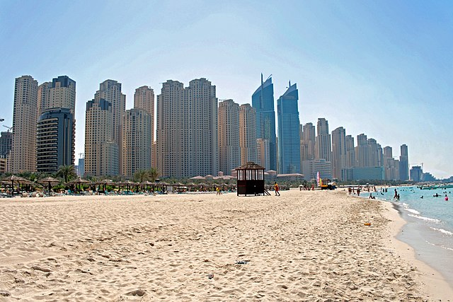

Jumeirah
========

A grpc framework for Golang 1.14+.

[Jumeirah Beach](https://www.google.com/maps/place/Jumeirah+Beach/@25.1940223,55.2298674,18z/data=!3m1!4b1!4m5!3m4!1s0x3e5f42035d9872df:0x29698a78cf7295ef!8m2!3d25.1939565!4d55.2316175) is a white sand beach that is located and named after the Jumeirah district of Dubai, on the coast of the Persian Gulf.

Features
--------

References
----------

Requirements 
------------

Installation
------------

Jumeirah As A Requirement
-------------------------

Quickstart
----------

Examples
--------

Code Structure
--------------

Server Model
------------

RPC Types
---------

Dispatcher
---------

Compile
-------

Environments
-------------

Configurations
--------------

Errors
------

Database
--------

Client
------

GRPC Metadata
-------------

Signals
-------

Logging
-------

Context
-------

Idepotent
---------

Unit testing
------------

Sessions
--------

Typing hint
-----------

Protocol documentation generation
---------------------------------

Proto linting
-------------

Code Deploy
-----------

Ops supports
------------

Development
-----------

